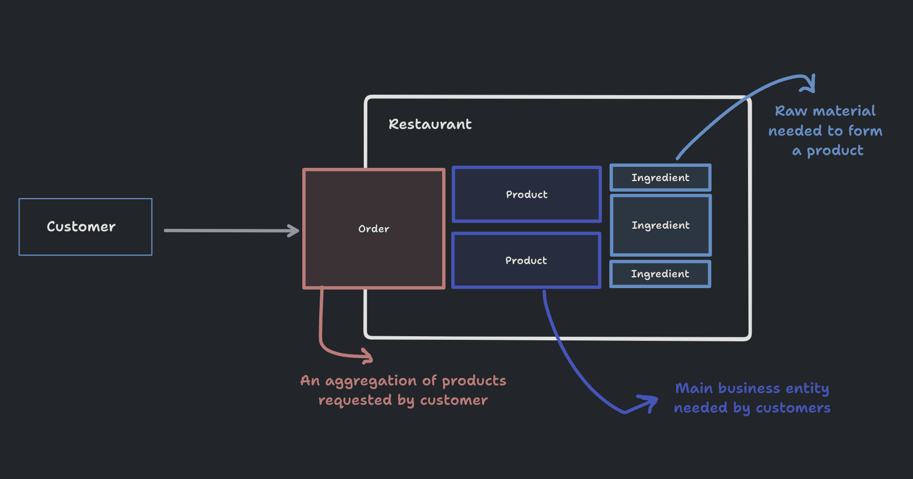

# Overview

This app represents a small kitchen/restaurant in which customers can request a set of meal(s) (product(s)) and receive it if the kitchen's supply of ingredients satisfies this.

To form a better understanding, take a look at the following [diagram](https://www.tldraw.com/s/v2_c_uwcyF2h-8NNvS5RZp69Ps?viewport=6%2C-945%2C3626%2C2479&page=page%3Apage):

## Business Constraints (Rules & Exceptions)

It is clear that the main business dependency and essential component in the kitchen is the availability of the ingredients that form products, which are the key focus of the business's customers.

The following constraints can be derived from the diagram:

- A sufficient supply of "Ingredients" required by the "Product" has to be present to fulfill an order.
- An "Order" must refer only to one of the products in the system.

## Business Continuity (Events)

From the given constraints, a notification for low supply is essential to keep the "Ingredients" in the kitchen in an "in-stock" status.

A 50% ratio has been picked for this notification, where every time an ingredient's supply goes below 50%, the kitchen owner is notified "only once"; further consumption is omitted from notifications unless the system is resupplied.

# Technical Details

## Installation
## Scaling
## Linting
## Testing
